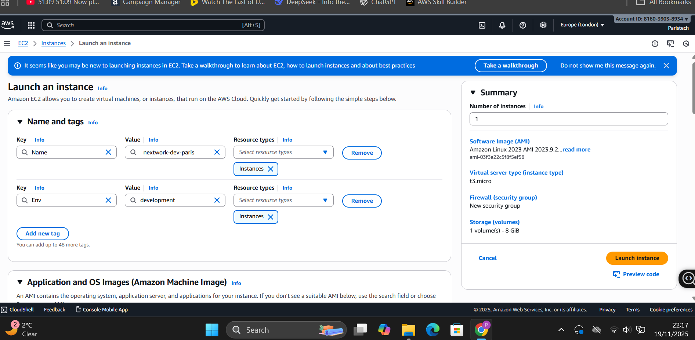
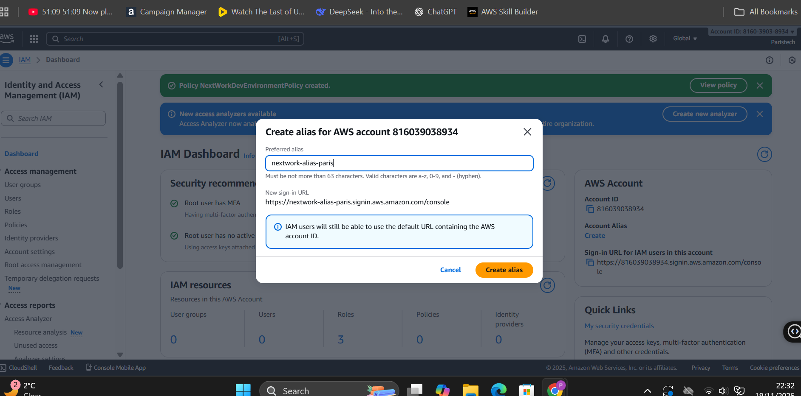

# Cloud Security with AWS IAM

This project demonstrates how to use **AWS Identity and Access Management (IAM)** to control access to EC2 instances and secure an AWS account.  
The goal was to learn how to authorize and authenticate users, create policies, and test permissions in a real-world scenario.

## Tools and Concepts
- **AWS Services:** EC2, IAM
- **Key Concepts Learned:**  
  - Creating EC2 instances (production and development)  
  - Setting up IAM users, groups, and policies  
  - Creating an account alias for simplified login  
  - Testing and verifying user permissions

## Project Steps

1. **EC2 Instances Setup**  
- Launched two EC2 instances: one **production** and one **development**.  

2. **IAM Policy Creation**  
- Created a JSON policy to allow users full access to the development instance but **deny access** to the production instance.  

3. **Account Alias**  
- Created an alias for easier login instead of using the account ID.  
- Tested the login via the alias to ensure it worked correctly.  

4. **User Groups and Users**  
- Created a user group and added IAM users (simulating dev interns).  
- Attached the policy to the group to enforce access permissions.  

## Key Learnings
- How to write and implement **custom IAM policies**  
- How to set up **user groups and permissions** effectively  
- Importance of testing policies by **logging in as different users**  
- Using **account aliases** for safer and easier login  
- Understanding the **principle of least privilege** in cloud security

## Reflection
- **Time to Complete:** ~20 minutes  
- **Most Challenging:** Getting the correct names for policies and instances  
- **Most Rewarding:** Testing the policy as a user and seeing permissions enforced correctly

## Next Steps / Improvements
- Extend the IAM policy to cover additional AWS services (S3, Lambda, etc.)  
- Implement **Multi-Factor Authentication (MFA)** for stronger security  
- Automate IAM user creation and policy attachment using Terraform or CloudFormation  
- Regularly audit IAM users and policies for compliance
